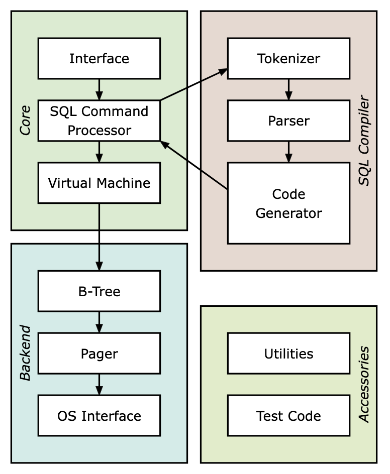

# Setup + Installation
Installing Ruby
```
brew update
brew install rbenv ruby-build
rbenv install 3.2.2
rbenv global 3.2.2
```

Add the following to your `.zshrc` file - use `code ~/.zshrc` to open in VSCode
```
eval "$(rbenv init -)"
export PATH="$HOME/.gem/ruby/3.2.0/bin:$PATH"
```
Then refresh via `source ~/.zshrc`

Install Bundler if needed
```
gem install bundler --user-install
```

Installing RSpec if needed
```
gem install rspec --user-install
```

# Introduction
Architecture of SQLite:
<p align="center">
  
</p>


# Features
* <u>Virtual Machine</u>: takes bytecode generated by the front-end as instructions
    * Can perform operations on one or more tables or indexes
    * Basically a big `switch` statement on the type of bytecode instruction
* <u>Pager</u>: receives commands to read/write pages of data
* <u>Persistence to disk</u>: we can save the database to a file and read it back out again
    * Done via a **pager**, which asks for page number x, and the pager gives us back a block of memory
    * First, it looks in its cache and on a cache miss, it copies data from disk into memory
    * When the user closes the connection to the db, we flush the cache to disk, close the DB file, and free the memory for Pager/Table data structures
* <u>Cursor</u>: represents a location in the table
* <u>B-Tree</u>: Data structure that represents both tables and indexes
    * Each node corresponds to one page, even if it's not full, so no need to handle for partial pages
    * *Order*: each node can have up to m children, where m is the tree's "order"


# C Trivia
### Difference between `memcpy()` and `strncpy()`

`void *memcpy(void *dest, const void *src, size_t n);`
* Copies exactly `n` bytes, regardless of the data or content.
* Does not stop at null characters (`'\0'`).
* Often used for binary data, structs, or raw memory.
* No null-termination logic.

`char *strncpy(char *dest, const char *src, size_t n);`
* Copies a null-terminated **string** with a size limit.
* Copies up to `n` characters or until a `'\0'` is encountered in `src`.
* If `src` is shorter than `n`, the rest of dest is padded with `'\0'`.
* If `src` is longer than or equal to `n`, the result is **not null-terminated** — this is a common gotcha.

### Unsigned types
When including `#include <stdint.h>`, we have:
* `uint8_t` → unsigned 8-bit integer
* `uint16_t` → unsigned 16-bit integer
* `uint32_t` → unsigned 32-bit integer
* `uint64_t` → unsigned 64-bit integer
